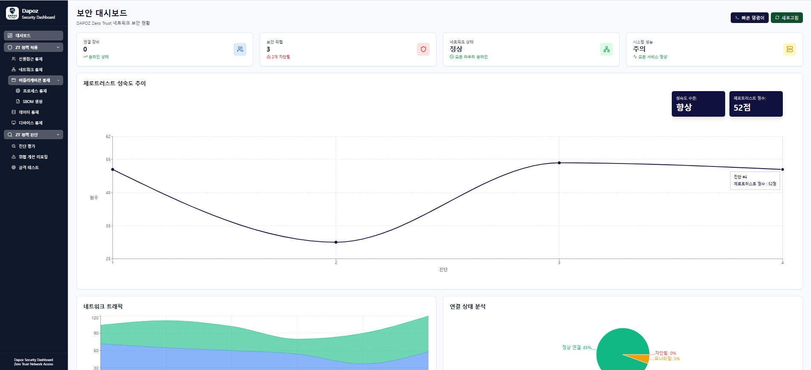
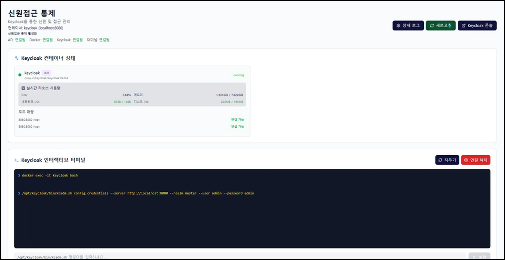
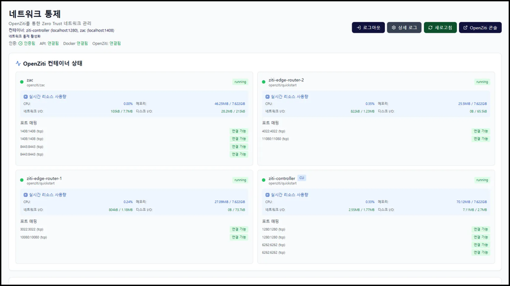
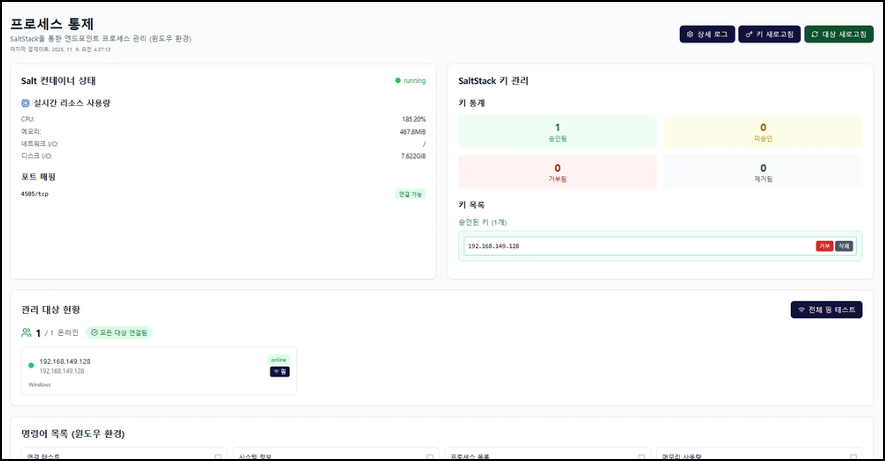
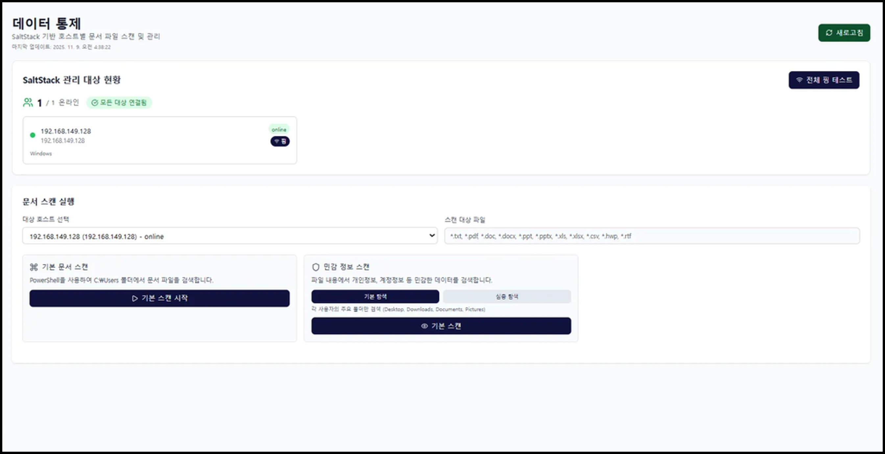
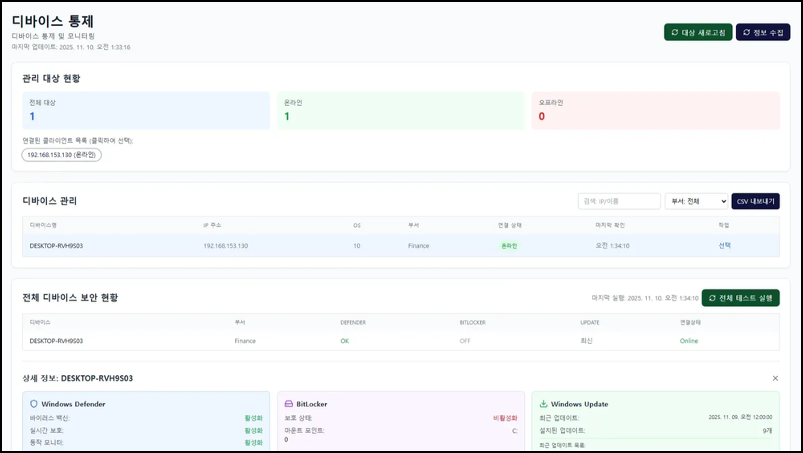
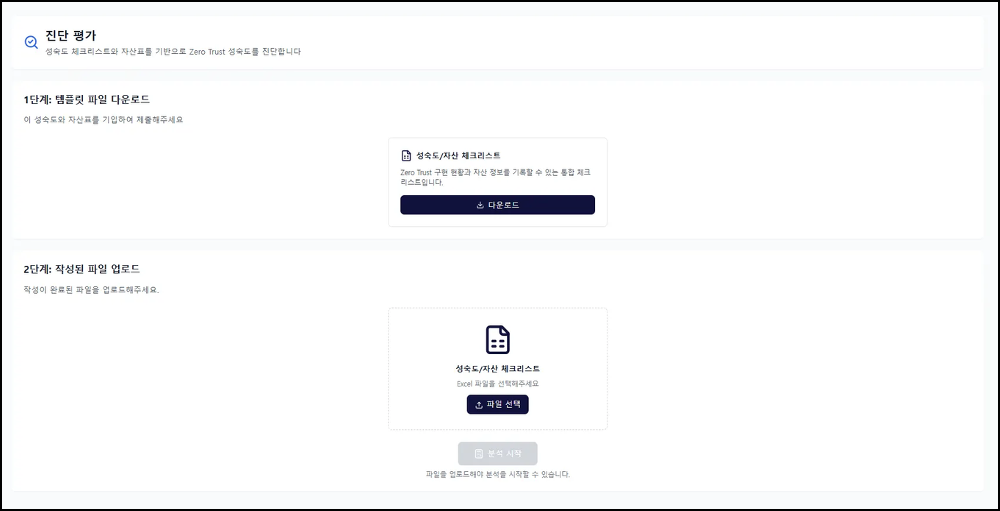
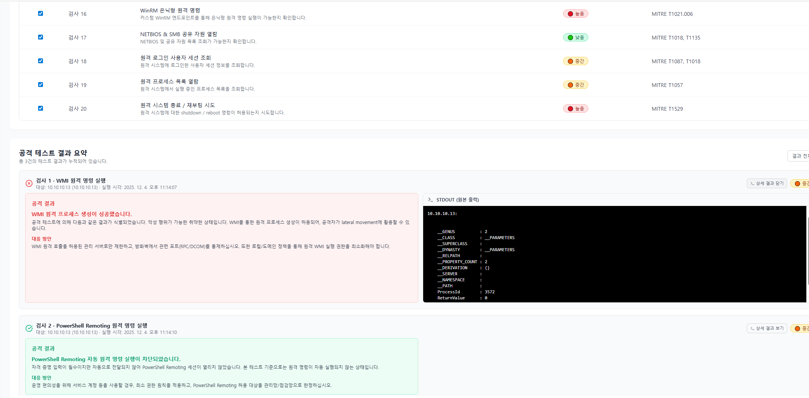

<p align="center">
  
</p>

<p align="center">
  <strong>Diagnostics & Policy for Zero Trust</strong>
</p>

<p align="center">
  <a href="#1-about-the-project">More About DAPOZ</a> •
  <a href="https://www.youtube.com/watch?v=GvnQ0POClyg" target="_blank">View Demo</a> •
  <a href="https://drive.google.com/file/d/1021UBvcwmeNuvWFx3tkc75LPeq3y4My2/view?usp=drive_link" target="_blank">Download Brochure</a> •
  <a href="mailto:BoB.DAPOZER.2025@gmail.com?subject=DAPOZ Bug Report" target="_blank">Report Bug</a>
</p>

---

## 목차 (Table of Contents)

- [About the Project](#1-about-the-project)
  - [Why DAPOZ?](#why-dapoz)
  - [Features](#features)
  - [Technologies](#technologies)
- [Getting Started](#2-getting-started)
  - [Prerequisites](#prerequisites)
  - [Install](#install)
- [Usage](#3-usage)
- [Architecture](#4-architecture)
- [Screenshots](#5-screenshots)
- [DAPOZ's VISION](#6-dapozs-vision)
- [License](#7-license)
- [Contact](#8-contact)

---

# [1] About the Project

## Why DAPOZ?

### DAPOZ는 조직이 **Zero Trust 보안 모델을 체계적으로 도입하고 관리**할 수 있도록 돕는 종합 보안 솔루션입니다.

Zero Trust를 도입하지 않은 기업도 **초기 기준선을 빠르게 확보**할 수 있으며, **진단과 개선을 통해 지속적으로 Zero Trust 수준을 강화**할 수 있습니다.

### DAPOZ는 다음과 같은 핵심 가치를 제공합니다:

* **BASELINE 구축**  
  DAPOZ는 제로트러스트 7필러 성숙도 초기 수준의 정책 적용이 가능하여 간편하고 효율적인 통합 보안 솔루션입니다. 각 필러에 해당하는 제로트러스트 정책을 DAPOZ 하나로 구현하고 자동화하여, 보다 안전하면서도 체계적인 보안 환경을 제공합니다. 이 모든 필러를 통합하고 자동화함으로써, 제로트러스트 보안 구현의 복잡함과 진입 장벽을 낮추어 기업의 안전성을 극대화하고 운영 효율성을 높입니다.

* **BIC Loop 기반 진단 및 평가**  
  DAPOZ는 자체 제작한 BIC loop 기반의 진단 및 평가 기능을 통해 기업의 제로트러스트 점수를 도출합니다. 해당 기능을 통해 제로트러스트를 고도화하고 지속적으로 관리할 수 있습니다.
  - **BASELINE**: 국내외 공신력 있는 기관(KISA, NIST, ISO)의 가이드라인을 토대로, 제로트러스트 7필러에 대한 초기 수준의 베이스라인 정책을 수립하고 보안체계에 적용합니다.
  - **INSIGHT**: BASELINE 구축 이후 환경 진단 및 평가를 수행합니다. 체크리스트 점수, 자산 중요도, 위협모델링 결과를 합산하여 보안 이행 수준과 위험 관리의 균형을 수치로 가시화합니다.
  - **CONSOLIDATION**: 진단 및 평가 결과를 바탕으로 미흡한 보안 영역을 정책적으로 보완하고 개선 방향을 제시합니다. 위험도가 높은 항목에 대해 우선순위를 선정하고, 해당 부분을 개선할 수 있는 방향을 제시합니다.

* **체계적인 위협 분석 및 평가**  
  MITRE ATT&CK을 기반으로 위협 시나리오를 식별하고, 위협 시나리오별로 가능성(likelihood)와 영향도(Impact)를 합산하는 위험도 평가를 진행합니다. 한국인터넷진흥원 제로트러스트 가이드라인 2.0과 CISA Zero Trust Maturity Model 가이드라인을 기반으로 7필러별 체크리스트를 설계하여 관리적·기술적 통제 항목의 이행 여부를 점검합니다.

* **정량적 성숙도 평가**  
  조직의 주요 자산의 기밀성, 무결성, 가용성(CIA)과 자산가치를 합산하여 최종 자산 중요도를 산출합니다. 기업의 로그와 사전에 식별한 위협 시나리오를 자동 매핑하고, 성숙도 수준 점수와 자산중요도, 위험지수를 합산하여 제로트러스트 최종 점수를 도출합니다. 도출한 최종 점수를 점수 구간별 성숙도 수준 정의에 따라 기업의 성숙도 수준을 진단할 수 있습니다.

* **AI 기반 위협 개선 지원**  
  RAG(Retrieval-Augmented Generation) 기반 AI 챗봇을 통해 위협별 맞춤형 개선 방안을 제공합니다.

---

## Features

### DAPOZ는 다음과 같은 기능을 제공합니다:

* **Zero Trust 정책 적용**  
  User, Device, Application&Workload, Data 등의 7대 필라를 통한 통합 보안 정책 적용 및 관리를 제공합니다.

* **Zero Trust 진단 및 평가**  
  체크리스트 기반 진단, 위협 시나리오 분석, 성숙도 평가를 통한 종합 보안 진단을 수행합니다.

* **위협 리포트 및 개선 방안**  
  MITRE ATT&CK 프레임워크 기반 위협 탐지, 이벤트 로그 분석, 구체적인 개선 방안을 제시합니다.

* **실시간 대시보드**  
  네트워크 트래픽, 보안 상태, 시스템 성능, Zero Trust 성숙도 추이를 실시간으로 모니터링합니다.

---

## Technologies

<p align="center">
  
  
  
  
  
  
  
  
  
  
  
  
  
  
</p>

DAPOZ는 다음과 같은 핵심 오픈소스 기술을 기반으로 구축되었습니다:

### 핵심 인프라 및 보안 기술

* **OpenZiti** - Zero Trust 네트워킹 플랫폼으로, 마이크로 세분화 네트워크 정책 적용 및 관리를 제공합니다.
* **Keycloak** - 오픈소스 Identity and Access Management (IAM) 솔루션으로, Single Sign-On (SSO) 및 사용자 인증/인가 관리를 제공합니다.
* **SaltStack** - 인프라 자동화 및 원격 관리 플랫폼으로, 다수의 엔드포인트에 대한 원격 명령 실행, 상태 관리, 프로세스 모니터링을 지원합니다.
* **FossLight Scanner** - 오픈소스 라이선스 및 의존성 분석 도구로, SBOM(Software Bill of Materials)을 자동으로 생성합니다.
* **MITRE ATT&CK** - 사이버 공격 기법 및 전술 프레임워크로, 위협 탐지 및 분석의 기준으로 활용됩니다.

### 애플리케이션 프레임워크

* **React 18.3+** (UI 프레임워크) | **TypeScript 5.5+** (타입 안정성) | **Tailwind CSS 3.4+** (스타일링) | **Vite 5.4+** (빌드 도구)
* **Node.js + Express 4.18+** (RESTful API 서버)
* **Recharts 3.2+** (차트 시각화) | **ECharts 5.4+** (고급 차트)

### AI/LLM 기술

* **LangChain 0.3+** (LLM 프레임워크) | **OpenAI API 4.20+** (GPT 모델) | **ChromaDB 1.8+** (RAG 벡터 저장소)

### 기타 도구

* **XLSX 0.18+** (Excel 파일 처리) | **Lucide React** (아이콘 라이브러리)

---

# [2] Getting Started

## Prerequisites

DAPOZ를 실행하기 위해 다음이 필요합니다:

* **Node.js** 18.0 이상
* **npm** 또는 **pnpm** 패키지 매니저
* **Git** (저장소 클론용)

### Optional (AI 챗봇 기능 사용 시)

* **OpenAI API Key** (환경 변수로 설정)
* **ChromaDB** (로컬 또는 원격 인스턴스)

## Install

### 개발 환경 설치 (개발자용)

#### 1) Init Server
Run the solution's server with the following command.
```bash
# DAPOZ Console
npm run dev

# DAPOZ Api
node server/index.cjs
```

#### 2) Init Packages
(under development)  
```(Administrator privileges) install.bat```  
```(Administrator privileges) run.bat```

#### 3) 환경 변수 설정 (선택사항)

AI 챗봇 기능을 사용하려면 `.env` 파일을 생성하고 OpenAI API 키를 설정하세요:

```bash
# .env 파일 생성
OPENAI_API_KEY=your-api-key-here
```

### 프로덕션 배포 설치

> **설치 파일 다운로드**  
> 모든 설치 파일은 [구글 드라이브](https://drive.google.com/drive/folders/120-xg5vbVe-Ml79MSSfKHGuBCGcd_Gpv)에서 다운로드할 수 있습니다.
> - **Master 폴더**: 어드민 서버 설치 파일
> - **Agent 폴더**: 관리 단말 설치 파일

#### 어드민 서버 설치

1. **사전 프로그램 설치 및 소스코드 다운로드**
   - [Prerequisites for DAPOZ Admin.zip](https://drive.google.com/drive/folders/17gzOdflxHr7O0LGL03qo93ql2eaoi1JN) 다운로드 및 설치
   - DAPOZ 소스코드를 GitHub에서 ZIP 다운로드

2. **이미지 파일 및 Install 파일 다운로드**
   - [DAPOZ_images.tar](https://drive.google.com/drive/folders/17gzOdflxHr7O0LGL03qo93ql2eaoi1JN) (약 2GB 이상)
   - [Install.zip](https://drive.google.com/drive/folders/17gzOdflxHr7O0LGL03qo93ql2eaoi1JN)
   - 원하는 망(네트워크)에 파일 옮기기

3. **Docker 이미지 로드**
   ```bash
   docker load -i DAPOZ_images.tar
   ```

4. **Install 스크립트 실행**
   ```bash
   # install.zip 압축 해제
   unzip Install.zip
   
   # install.sh 실행
   ./install.sh
   ```
   - 실행 시 ziti password가 출력됩니다
   - **중요**: password를 다른 곳에 저장하거나 기입해둡니다
   - `Y`를 입력하고 Enter를 누릅니다

5. **DAPOZ 소스코드 실행**
   ```bash
   # DAPOZ 소스코드 ZIP 압축 해제 (git clone 상관없음)
   unzip DAPOZ-Solution.zip
   
   # start.sh 실행
   ./start.sh
   ```

#### 관리 단말 설치

1. **Agent 파일 패키지 다운로드**
   - [agent.zip](https://drive.google.com/drive/folders/1DT3iDrY2yWNtOFB53SLOkyV2nmVPaht5) 다운로드

2. **필수 프로그램 설치**
   다음 프로그램들을 모두 설치합니다:
   - `Salt-Minion-3006.16-Py3-AMD64-Setup.exe`
   - `fluent-bit-4.0.10-win64.exe`
   - `jdk-21.0.8_windows-x64_bin.exe`
   
   > **주의**: Salt-Minion 설치 시 **DAPOZ Admin 장비의 IP 주소**를 입력해야 합니다.

3. **Tika 파일 배치**
   - `tika-app-3.2.3.jar` 파일을 **바탕화면**으로 옮깁니다
---

# [3] Usage

## 주요 기능 사용법

### 1. Zero Trust 정책 적용

**경로**: `/zt-policy-apply`

다음과 같은 영역별로 Zero Trust 정책을 적용할 수 있습니다:

* **통합 통제** (`/zt-policy-apply/integrated`)
* **신원 통제** (`/zt-policy-apply/identity`)
* **네트워크 통제** (`/zt-policy-apply/network`)
* **프로세스 통제** (`/zt-policy-apply/process`)
* **디바이스 통제** (`/zt-policy-apply/device`)
* **데이터 통제** (`/data-control`)

### 2. Zero Trust 진단 및 평가

**경로**: `/zt-policy-diagnosis`

#### 2.1 체크리스트 (`/zt-policy-diagnosis/checklist`)

Network, Identity, Device, Application, Data 카테고리별 체크리스트를 작성하고 관리할 수 있습니다.

#### 2.2 진단 평가 (`/zt-policy-diagnosis/diagnosis-evaluation`)

Excel 파일을 업로드하여 Zero Trust 성숙도를 평가할 수 있습니다:

1. **체크리스트 파일 업로드**: Zero Trust 구현 항목 체크리스트
2. **자산 파일 업로드**: 시스템 자산 및 위협 시나리오 정보
3. **진단 실행**: 서버에서 종합 평가 수행
4. **결과 확인**: Zero Trust 점수 및 성숙도 레벨 확인

**지원 파일 형식**: `.xlsx`, `.xls`

**템플릿 다운로드**: `/templates/check.xlsx`

#### 2.3 평가 (`/zt-policy-diagnosis/evaluation`)

네트워크, 프로세스, 정책 문서별 Zero Trust 평가를 수행할 수 있습니다.

### 3. SBOM 생성

**경로**: `/zt-policy-apply/sbom`

FossLight Scanner를 활용한 소스코드 SBOM 생성:

1. **Repository URL 입력**: Git 저장소 URL (HTTPS 또는 SSH)
2. **옵션 설정**:
   * Branch (기본값: main)
   * Subdirectory (선택사항)
   * 인증 방법 (Public/Private Repository)
   * 출력 포맷 (Opossum, Excel, CSV, YAML, SPDX 등)
3. **스캔 시작**: 백그라운드 작업으로 SBOM 생성
4. **결과 다운로드**: 생성된 SBOM 파일 다운로드

**지원 출력 포맷**:
* 일반 포맷: Opossum, Excel, CSV, YAML
* SPDX 포맷: JSON, YAML, Tag, XML

### 4. 위협 리포트 및 개선 방안

**경로**: `/zt-policy-diagnosis/threat-report`

진단 평가 결과를 기반으로 MITRE ATT&CK 기반 위협 분석 및 개선 방안을 제공합니다.

* **탐지된 위협 시나리오**: 이벤트 로그 기반 위협 탐지
* **위협별 상세 분석**: 
  * 위협 설명 및 공격 시나리오
  * 이벤트 로그 정보 및 판단 근거
  * 발생 가능 상황 분석
  * 구체적인 보안 대책
* **AI 챗봇 연동**: 위협별 맞춤형 질의응답

### 5. AI 챗봇

**경로**: 위협 리포트 페이지 또는 우하단 챗봇 버튼

RAG 기반 AI 챗봇을 통해 위협 개선 방안에 대해 질문할 수 있습니다.

* **MITRE ATT&CK 기반 답변**: Runbook 문서를 참고한 정확한 답변
* **위협별 컨텍스트**: 특정 위협에 대한 맞춤형 질의응답
* **참고 자료 제공**: 답변에 사용된 MITRE 기법 정보 표시

**예시 질문**:
* "T1003 자격증명덤프에 대한 상세 개선 방안 알려줘"
* "T1098 계정 조작 방어 방법"
* "자격 증명 덤프 공격 설정 방법"

### 6. 대시보드

**경로**: `/dashboard`

실시간 보안 모니터링 대시보드:

* **연결 장비 수**: 현재 온라인 상태인 장비 수
* **보안 위협**: 탐지된 위협 및 차단 현황
* **네트워크 상태**: 네트워크 트래픽 및 연결 상태
* **시스템 성능**: CPU, 메모리, 네트워크 처리량
* **Zero Trust 성숙도 추이**: 시간에 따른 Zero Trust 점수 변화 그래프
* **빠른 명령어 실행**: Docker, Ziti 등 시스템 명령어 실행

---

# [4] Architecture

## 시스템 구조

```
DAPOZ/
├── src/                    # 프론트엔드 소스코드
│   ├── components/        # React 컴포넌트
│   ├── pages/             # 페이지 컴포넌트
│   ├── lib/               # 라이브러리 및 유틸리티
│   └── utils/             # 유틸리티 함수
├── server/                # 백엔드 서버
│   ├── routes/            # API 라우트
│   ├── llm/               # LLM 관련 서비스
│   └── index.cjs          # Express 서버 진입점
├── public/                # 정적 파일
│   ├── logo/              # 로고 이미지
│   └── templates/         # Excel 템플릿
└── package.json           # 프로젝트 설정
```

## 주요 컴포넌트

### 프론트엔드
* **Dashboard**: 실시간 보안 모니터링
* **ZTChecklist**: Zero Trust 체크리스트 관리
* **DiagnosisEvaluation**: 진단 평가 실행
* **Sbom**: SBOM 생성 및 관리
* **ThreatReport**: 위협 리포트 및 개선 방안
* **ThreatChatbot**: AI 챗봇 컴포넌트

### 백엔드
* **Express Server**: RESTful API 서버
* **LLM Service**: LangChain 기반 챗봇 서비스
* **Vector Store**: ChromaDB 벡터 저장소
* **Document Loader**: MITRE ATT&CK Runbook 로더

---

# [5] Screenshots

## Dashboard

---

<p align="center">
  
</p>

## Identity

---

<p align="center">
  
</p>

## Network

---

<p align="center">
  
</p>

## Application

---

<p align="center">
  
</p>

## Data

---

<p align="center">
  
</p>

## Device

---

<p align="center">
  
</p>

## Diagnostic

---

<p align="center">
  
</p>

<p align="center">
  
</p>

## Threat Report

---

<p align="center">
  
</p>

## Attack Test

---

<p align="center">
  
</p>

## AI 챗봇

---

<p align="center">
  
</p>

---

# [6] DAPOZ's VISION

### "DAPOZ로 제로트러스트 도입을 스마트하고 간편하게"

**제로트러스트 도입의 복잡성 최소화**

모든 기업이 복잡한 사전 준비나 전문 인력 없이도 부담없이 제로트러스트 보안을 도입할 수 있도록 기여하겠습니다.

**제로트러스트 보안체계 도입 촉진**

해외에서는 제로트러스트 도입이 활발히 진행되고 있으며, 국내에서는 KISA가 제로트러스트 가이드라인 2.0을 발표하여 그 중요성을 강조하고 있습니다. 이러한 환경 속에서 DAPOZ는 제로트러스트 도입의 진입 장벽을 낮추고, 체계적인 도입을 추진하여 제로트러스트 보안 체계를 촉진시키겠습니다.

**기업 보안의 미래 대비**

끊임없이 진화하는 사이버 위협에 대응하기 위해 지속적인 보안 기술 연구를 진행하며 장기적이고 혁신적인 보안 역량 강화를 도모하겠습니다.

**오픈소스 기반 접근성**

Apache 2.0 라이선스로 제공되는 오픈소스 솔루션으로, 조직의 규모와 예산에 관계없이 누구나 사용할 수 있습니다. 커뮤니티의 기여를 통해 지속적으로 발전합니다.

---

# [7] License

이 프로젝트는 **Apache License 2.0** 라이선스 하에 배포됩니다.

자세한 내용은 [LICENSE](LICENSE) 파일을 참조하세요.

---

# [8] Contact

* **이메일**: BoB.DAPOZER.2025@gmail.com
* **이슈 리포트**: [GitHub Issues](https://github.com/your-org/dapoz/issues)
* **토론**: [GitHub Discussions](https://github.com/your-org/dapoz/discussions)

DAPOZ는 오픈소스 프로젝트로, 모든 분의 기여와 협력을 환영합니다. 함께 더 안전한 디지털 환경을 만들어가요!

---

<p align="center">
  <strong>Made with DAPOZER - DiAgnostics & POlicy for ZERotrust</strong>
</p>
